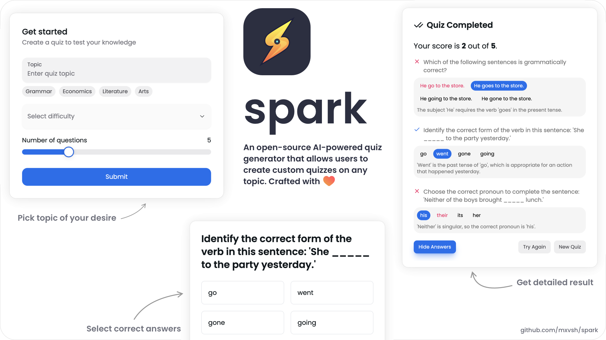

<div align="center">
<h1>spark - AI-powered quiz generator</h1>

<p>✨ spark is an open-source AI-powered quiz generator that allows users to create custom quizzes on any topic. Built with Next.js and TailwindCSS.
</p>


</div>

## Table of Contents

- [Features](#features)
- [Usage](#usage)
- [Roadmap](#roadmap)
- [Contributing](#contributing)

## Features

I plan to keep Spark simple and easy to use. Here are some of the features that Spark offers right now:

- 🧠 Generate quizzes on any topic
- 🎚️ Choose difficulty levels: Easy, Medium, Hard
- 🔢 Select the number of questions
- 📖 Get detailed explanations for each question

## Usage

To run this project locally, follow these steps:

1. Clone the repository:

```bash
git clone git@github.com:mxvsh/spark.git
```

2. Install the dependencies:

```bash
bun install # or npm install
```

3. Create a `.env.local` file in the root directory and add the following environment variables:

- `PROVIDER`: The AI provider you want to use (ollama or openai)
- `MODEL`: The model you want to use (eg. gpt-4o-mini or mistral:7b)
- `OPENAI_API_KEY`: Your OpenAI API key (required if you choose openai as the provider)

4. Start the development server:

```bash
bun dev # or npm run dev
```

## Roadmap

Although Spark is fully functional, there are a few features that I would like to add in the future:

- [ ] Add support for timer
- [ ] Save user progress
- [ ] Daily quizzes
- [ ] Add support for code-based questions

## Contributing

If you have any ideas on how to improve Spark, feel free to open an issue or submit a pull request. I would love to hear your feedback!
